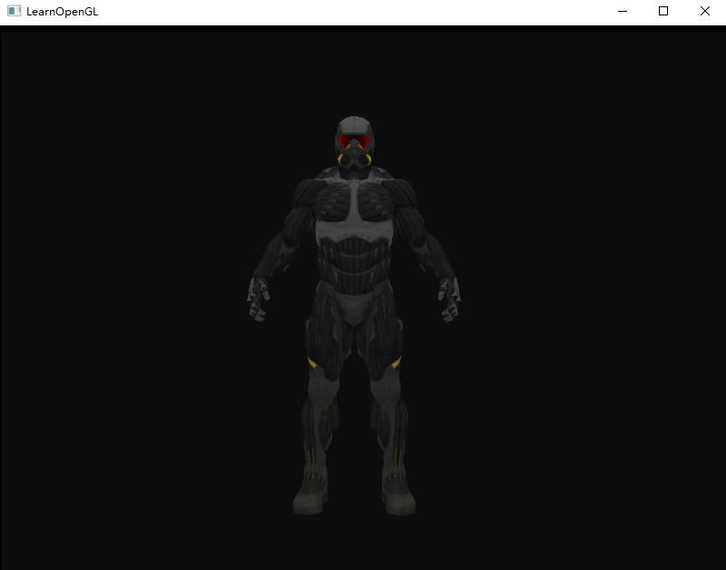

# 迷宫射击游戏

 **CG final project, a simple first-person-shooter game in maze, based on OpenGL 3.3+** 

------


## 文件目录

- 3rd_party/ 包括已下载的第三方库。

  ```
  3rd_party/
  ----assimp/ 
  ----glad/
  ----glfw/
  ----glm/
  ```

  版本分别为

  - assimp-4.1.0
  - [glad](https://glad.dav1d.de/)（Language 设置为 **C/C++**，在API选项中，选择 **3.3** 以上的 OpenGL(gl) 版本，模式 (Profile) 设置为**Core**，并且选中**生成加载器** (Generate a loader) 选项 ）
  - glfw-3.3.bin.WIN32
  - glm-0.9.8.5

- configuration/ 中为 Cmake 需要的文件，用于配置项目的根目录路径，以加载 Shader 等文件。

- doc/ 存储项目文档，其中的 imgs 存放相关截图展示阶段性的效果。

- include/  包括本地的头文件，引用自<https://github.com/JoeyDeVries/LearnOpenGL/tree/master/includes/learnopengl> 。

- resources/ 包括素材资源模型等文件，引用自 <https://github.com/JoeyDeVries/LearnOpenGL/tree/master/resources> 。

- src/ 包括源文件，其中 Shader/ 中为着色器文件。

------


## 安装运行环境

- 目前只支持 Windows 10 
- `git clone https://github.com/hansenbeast/MazeShootingGame.git`
- 在项目根目录下新建 build/，使用 Cmake-gui 生成 Visual Studio 解决方案
- 将 `build/3rd_party/assimp/include/assimp`中的 `config.h` 移动到 `3rd_party/assimp/include/assimp` 中
- 使用 VS 打开 `build/MazeShootingGame.sln`,将 MazeShootingGame 作为启动项目后，然后设置 build 属性为 Debug 和 Win32，最后生成解决方案，如果没问题的话，启动 `build/Debug` 中的 `MazeShootingGame.exe` 运行即可。

------


## 测试截图

------



------


## 协作说明

1. 目前的第三方库只支持如上所列，如需使用其他的第三方库，则需要在 3rd_party 中加入源码，并更新 CmakeLists.txt（未使用预先编译好的库的原因是保证生成的库是兼容你的操作系统和CPU的 ，使用提供源代码所产生的一个问题在于不是每个人都用相同的IDE开发程序，因而提供的工程/解决方案文件可能和一些人的IDE不兼容），然后重新 Cmake 生成新的解决方案，这样才可以在源文件中引入头文件。
2. 对于多人协作开发，由于邀请后每个成员都是仓库的合作者，注意每次 push 时，需要解决冲突，最好是每个人在自己的分支上开发，最后再 merge 到 master 分支。注意不需要将本地的 build/ 目录上传
3. 欢迎补充

------


## 模块记录

> 使用OpenGL进行开发，对使用的库不做限制(包括物理引擎库、图像处理库、动画库等)。但需要实现以下知识点(注意将知识点有机结合，而非简单堆凑)：    

### Basic

1. Camera Roaming 
2. Simple lighting and shading(phong) 
3. Texture mapping
4. Shadow mapping 
5. Model import & Mesh viewing (Assimp)

### Bonus:

1. Sky Box (天空盒) 
2. Display Text (显示文字，中文/英文/立体/平面) 
3. Stencil Test (模板测试) 
4. Complex Lighting (复杂光照: Gamma矫正、法线贴图、HDR、SSAO…) 
5. Gravity System and Collision Detection (重力系统与碰撞检测) 
6. Skeletal Animation (骨骼动画) 
7. Particle System (粒子系统: 渲染雨、雪、雾等) 
8. Explosion Effect (爆炸效果) 
9. Anti-Aliasing (抗锯齿) 
10. Fluid Simulation (流体模拟) 
11. ...   


